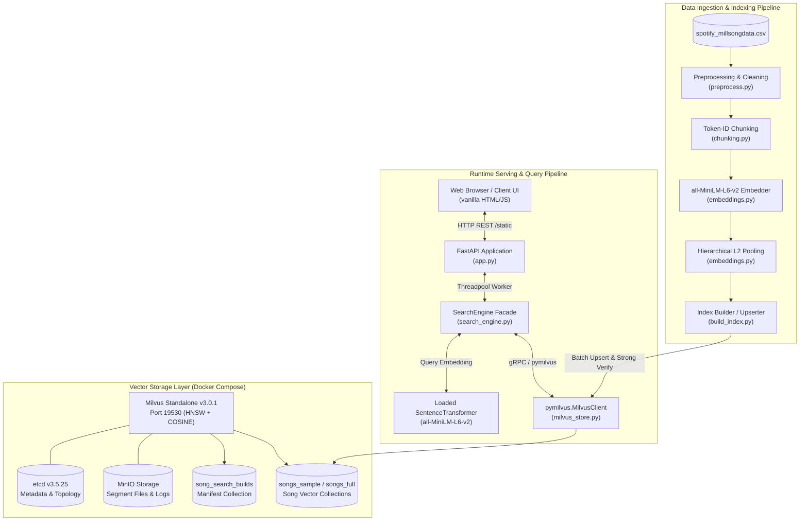
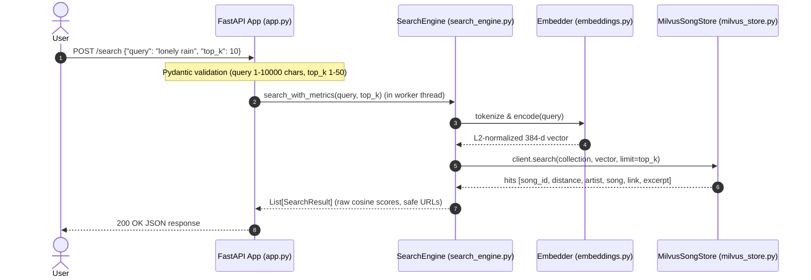

# Lyrics Semantic Song Search — System Architecture

This document provides a comprehensive technical breakdown of the architecture, data flow, storage contracts, and design principles of the Lyrics Semantic Song Search Engine.

---

## 1. High-Level System Overview

The system is a dedicated **lyrics-only semantic search engine**. Rather than relying on acoustic features (tempo, key, instruments, or genre labels), the engine operates exclusively on lyrical themes, moods, and semantic intent using dense sentence embeddings.



---

## 2. Core Architecture Subsystems

### 2.1. Ingestion & Preprocessing Subsystem
Located in: [`src/preprocess.py`](file:///D:/data%20science%20and%20analysis/data%20analysis%20with%20python/deep%20learning/week2/src/preprocess.py)

1. **Source Data Contract:**
   - Expects CSV data with headers: `artist`, `song`, `link`, `text`.
   - Reads all columns strictly as string objects to avoid dtype coercion artifacts.
2. **Deterministic Positional ID:**
   - Every song is assigned an immutable string ID based on its positional order in the cleaned, deduplicated corpus *before* sampling.
   - Preserving this ordering guarantees that FAISS migration, Milvus upserts, and offline evaluations align perfectly on identical songs.
3. **Data Hygiene & Cleansing:**
   - Drops rows with null, empty, or whitespace-only lyrics.
   - Normalizes whitespace characters (newlines, tabs, consecutive spaces) into single spaces without removing punctuation, casing, or negative words (preserving semantic mood).
   - Deduplicates identical `(artist, song, text)` tuples while keeping songs with the same title if artist or lyrics differ.
4. **Dataset Fingerprinting:**
   - Streams an incremental `SHA-256` digest over the raw CSV file to record in the build manifest for provenance verification.
5. **Safe URL Sanitization:**
   - The raw `link` attribute is validated via `safe_source_url()`. Only absolute `http://` or `https://` URLs are exposed as clickable links.

---

### 2.2. Chunking & Token-ID Windowing Subsystem
Located in: [`src/chunking.py`](file:///D:/data%20science%20and%20analysis/data%20analysis%20with%20python/deep%20learning/week2/src/chunking.py)

Conventional text chunking by characters or words often causes tokenizer truncation hazards or re-tokenization drift when decoded back to text. The system uses a strict **Token-ID Chunking** strategy:

```mermaid
flowchart LR
    LyricText["Full Lyric Text"] -->|Tokenizer (no specials)| TokenIDs["Token IDs: [t0, t1, ..., tN]"]
    TokenIDs --> Window1["Chunk 0..200"]
    TokenIDs --> Window2["Chunk 168..368"]
    TokenIDs --> Window3["Chunk 336..N (Final Partial)"]
    Window1 -->|prepare_for_model| ModelInput1["[CLS] + Window1 + [SEP]"]
    Window2 -->|prepare_for_model| ModelInput2["[CLS] + Window2 + [SEP]"]
    Window3 -->|prepare_for_model| ModelInput3["[CLS] + Window3 + [SEP]"]
```

* **Window Parameters:**
  - Content Chunk Size: `200` token IDs.
  - Overlap: `32` token IDs.
  - Stride: `168` token IDs ($200 - 32$).
* **Special Token Management:**
  - Lyrics are tokenized without special tokens (`add_special_tokens=False`).
  - Slices are passed to `tokenizer.prepare_for_model`, which explicitly prepends `[CLS]` and appends `[SEP]` along with attention masks.
  - Slices are never decoded back to text; tokens feed directly to model tensors.
  - Total sequence length is validated against the model's physical input limit (e.g., 256 / 512 tokens).

---

### 2.3. Embedding & Hierarchical Pooling Pipeline
Located in: [`src/embeddings.py`](file:///D:/data%20science%20and%20analysis/data%20analysis%20with%20python/deep%20learning/week2/src/embeddings.py)

To represent an entire song as a single vector while preserving signals from various verses and choruses:

1. **Model:** `sentence-transformers/all-MiniLM-L6-v2` (output dimension $d = 384$). Frozen inference only; no task-specific fine-tuning.
2. **Chunk Normalization:** Each token-chunk embedding is unit-normalized ($L_2$ norm = 1.0).
3. **Song-Level Mean Pooling:** For a given song with $K$ chunks:
   $$\mathbf{v}_{\text{raw}} = \frac{1}{K} \sum_{k=1}^K \frac{\mathbf{e}_k}{\|\mathbf{e}_k\|_2}$$
4. **Song Vector Normalization:** The resulting mean vector is re-normalized:
   $$\mathbf{v}_{\text{song}} = \frac{\mathbf{v}_{\text{raw}}}{\|\mathbf{v}_{\text{raw}}\|_2}$$
5. **Query Normalization:** Search queries are embedded through the same model and $L_2$-normalized. Under unit-norm vectors, **Cosine Similarity** equals the **Inner Product** (Dot Product):
   $$\cos(\mathbf{q}, \mathbf{v}) = \frac{\mathbf{q} \cdot \mathbf{v}}{\|\mathbf{q}\|_2 \|\mathbf{v}\|_2} = \mathbf{q} \cdot \mathbf{v}$$

---

### 2.4. Vector Database Architecture (Milvus v3.0.1)
Located in: [`src/milvus_store.py`](file:///D:/data%20science%20and%20analysis/data%20analysis%20with%20python/deep%20learning/week2/src/milvus_store.py) and [`deploy/milvus/docker-compose.yml`](file:///D:/data%20science%20and%20analysis/data%20analysis%20with%20python/deep%20learning/week2/deploy/milvus/docker-compose.yml)

Milvus runs in Standalone mode orchestrated with `etcd` and `MinIO`:

* **Container Topology:**
  - `milvus-standalone` (`milvusdb/milvus:v3.0.1`): Main query, coordinator, and data node.
  - `milvus-etcd` (`quay.io/coreos/etcd:v3.5.25`): Metadata store and cluster consensus.
  - `milvus-minio` (`quay.io/minio/minio:...`): Object storage for persistent segment log files.
* **Security & Network Boundary:**
  - All container ports are explicitly bound to loopback `127.0.0.1` (`19530` gRPC, `9091` HTTP healthz, `9000/9001` MinIO).

#### Collection Schema (Schema Version 1)
Dynamic fields are explicitly disabled (`enable_dynamic_field=False`). Schema fields are strictly typed:

| Field Name | Type | Key / Constraint | Description |
| :--- | :--- | :--- | :--- |
| `song_id` | `VARCHAR(64)` | Primary Key (`auto_id=False`) | Deterministic positional ID string (e.g., `"42"`). |
| `vector` | `FLOAT_VECTOR(384)` | Dense Vector | $L_2$-normalized song embedding. |
| `artist` | `VARCHAR(512)` | Required | Artist name (max observed in data: 44 bytes). |
| `song` | `VARCHAR(512)` | Required | Song title (max observed in data: 77 bytes). |
| `link` | `VARCHAR(2048)` | Nullable | Original source URL/path. |
| `lyrics_excerpt` | `VARCHAR(2048)` | Nullable | First ~300 chars of lyrics with ellipsis for UI display. |

#### Vector Index Design
- **Index Type:** `HNSW` (Hierarchical Navigable Small World graph search).
- **Metric Type:** `COSINE`.
- **HNSW Parameters:** `M=16`, `efConstruction=200`, query-time `ef=64`.
- **Rationale:** Accelerates vector similarity search using hierarchical proximity graphs, maintaining high recall while providing fast sub-linear search latency.

---

### 2.5. Manifest Registry & Integrity Management

To prevent data corruption, partial index serving, and accidental index overwrites:

1. **Registry Collection (`song_search_builds`):**
   - Independent Milvus collection storing JSON build manifests for each indexed song collection.
   - Contains: build status (`importing` $\to$ `complete`), schema version, model ID and commit hash, chunking parameters, dataset hash, seed, and verified song counts.
2. **Two-Phase Commit State Machine:**
   - An import first writes an `importing` record to `song_search_builds`.
   - Records are upserted into the song collection in batches.
   - Verification pass performs a **Strong Consistency** readback:
     - Exact row count matches expected rows.
     - Set of retrieved primary keys matches expected set.
     - Vectors and metadata are read back and validated for finite values and norms.
   - Only upon verification does the state transition to `complete`.
3. **Strict Separation:**
   - Sample collections (`songs_sample`) cannot be written with full builds.
   - Full collections (`songs_full`) cannot be written with sample builds.
   - Mismatched content signatures reject mutations to prevent corrupting an existing collection.

---

### 2.6. Runtime Serving & Query Lifecycle
Located in: [`src/app.py`](file:///D:/data%20science%20and%20analysis/data%20analysis%20with%20python/deep%20learning/week2/src/app.py) and [`src/search_engine.py`](file:///D:/data%20science%20and%20analysis/data%20analysis%20with%20python/deep%20learning/week2/src/search_engine.py)



* **Non-Blocking Lifespan:**
  - Initial connection to Milvus and SentenceTransformer model loading happen during application startup in an asynchronous background thread.
  - If Milvus is unavailable, the server still boots; `/health` returns `ready: false` with actionable hints, and `/search` cleanly responds with HTTP 503 (no server crashes or leaking stack traces).
  - Throttled background retry (`RETRY_SECONDS = 15.0`) checks for database availability when requests arrive.
* **Query Execution:**
  - Validates that query length does not exceed model tokenizer capacity (rejects with 422 if exceeded).
  - Encodes the search prompt into a 384-d unit vector.
  - Dispatches exact vector search to Milvus with output fields: `artist`, `song`, `link`, `lyrics_excerpt`.
  - Maps distance scores directly as raw cosine similarities without artificial probability scaling.

---

### 2.7. Verification, Baseline, and Evaluation Layer
Located in: [`src/verify_migration.py`](file:///D:/data%20science%20and%20analysis/data%20analysis%20with%20python/deep%20learning/week2/src/verify_migration.py), [`src/evaluate.py`](file:///D:/data%20science%20and%20analysis/data%20analysis%20with%20python/deep%20learning/week2/src/evaluate.py), and [`src/tfidf_baseline.py`](file:///D:/data%20science%20and%20analysis/data%20analysis%20with%20python/deep%20learning/week2/src/tfidf_baseline.py)

1. **Parity Verification (`verify_migration.py`):**
   - Asserts mathematical equivalence between Milvus search results and legacy FAISS `IndexFlatIP` results.
   - Tolerates numerical floating-point differences up to $10^{-5}$ and accounts for tie-breaking ambiguity when vectors have identical scores.
2. **Evaluation Framework (`evaluate.py`):**
   - Curated query set in `evaluation/queries.json` split into 10 `development` queries and 20 `final_test` queries.
   - Generates candidate pools for graded human relevance judgments (0 = not relevant, 1 = partially relevant, 2 = strongly relevant).
   - Computes rank-aware metrics: Precision@5 (strict grade 2) and nDCG@10 (normalized discounted cumulative gain).
3. **Lexical Baseline (`tfidf_baseline.py`):**
   - Implements a sparse TF-IDF retrieval baseline over the same dataset to benchmark dense semantic search against traditional lexical keyword matching.

---

## 3. Directory & File Reference

```
.
├── .env.example                     # Environment template (MILVUS_URI, MILVUS_COLLECTION, etc.)
├── requirements.txt                 # Pinned dependencies (pymilvus==3.0.1, fastapi, torch, etc.)
├── deploy/
│   └── milvus/
│       ├── docker-compose.yml       # Milvus Standalone + etcd + MinIO configuration
│       └── volumes/                 # Persistent database storage directory
├── data/
│   └── spotify_millsongdata.csv     # Raw Kaggle Million Song dataset
├── artifacts/
│   └── sample/                      # Precomputed baseline FAISS sample artifacts
├── evaluation/
│   ├── queries.json                 # Fixed dev & test evaluation queries
│   └── candidates_to_judge.csv      # Human-graded relevance evaluation pool
├── src/
│   ├── __init__.py
│   ├── config.py                    # Constants, validation, and environment configuration
│   ├── preprocess.py                # Dataset loading, cleaning, and fingerprinting
│   ├── chunking.py                  # Token-ID slicing and special-token handling
│   ├── embeddings.py                # SentenceTransformer loader & chunk/mean pooling
│   ├── milvus_store.py              # MilvusClient wrapper, schema v1, manifests, and upsert
│   ├── build_index.py               # CLI: Ingest CSV -> Embed -> Import into Milvus
│   ├── migrate_faiss_to_milvus.py   # CLI: Fast vector migration from FAISS to Milvus
│   ├── verify_migration.py          # CLI: Bitwise / tolerance parity checker
│   ├── search_engine.py             # SearchEngine domain service
│   ├── app.py                       # FastAPI application and routing
│   ├── tfidf_baseline.py            # Sparse TF-IDF lexical search baseline
│   ├── evaluate.py                  # Semantic search ranking evaluation
│   └── evaluate_tfidf.py            # TF-IDF ranking evaluation
├── static/
│   ├── index.html                   # Clean single-page search interface
│   ├── styles.css                   # Custom responsive styling
│   └── app.js                       # Frontend search & health interaction
└── tests/                           # Pytest unit tests (uses fake in-memory Milvus)
```

---

## 4. Key Architectural Guarantees

* **Zero Data Loss & Safe Upserts:** Existing collections are never dropped or silently mutated.
* **No Implicit Fallbacks:** Never falls back to Milvus Lite or FAISS silently; if Milvus is down, it signals the exact state.
* **High Recall & Low Latency:** HNSW graph index with COSINE metric provides fast approximate nearest neighbor retrieval.
* **Token Integrity:** Token-ID windowing avoids hidden tokenizer truncation of long songs.
