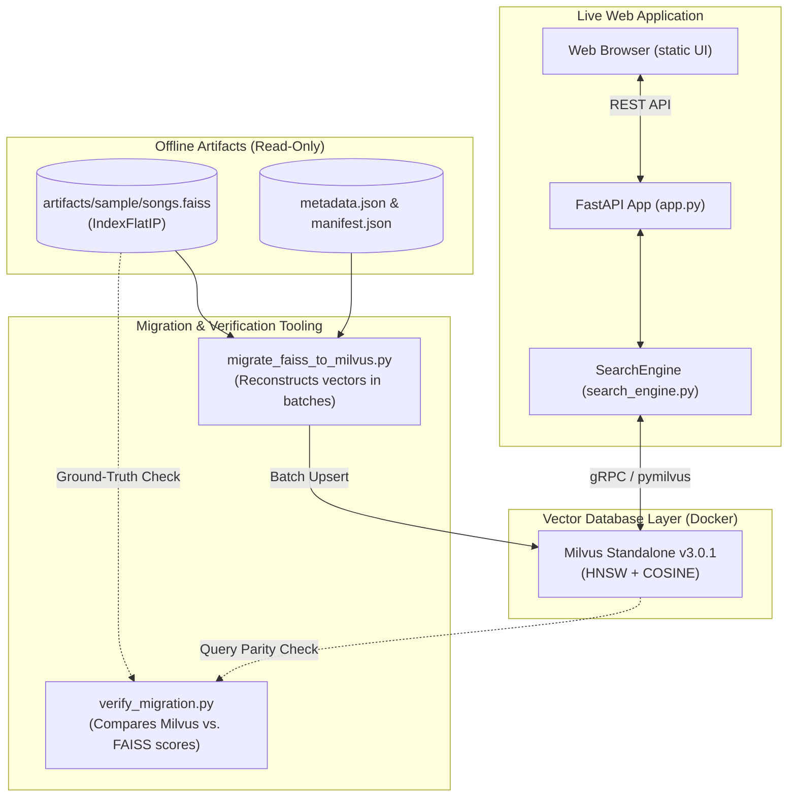

# Role of FAISS in the Song Search Project

This document explains why **FAISS** is still present in the repository, what role it serves alongside **Milvus**, and whether it can eventually be removed.

---

## 1. Executive Summary

In this project, **FAISS is no longer used for runtime search serving**. 

- The live web application ([`src/app.py`](src/app.py)) and the search service ([`src/search_engine.py`](src/search_engine.py)) communicate **exclusively with Milvus Standalone** via `pymilvus.MilvusClient`.
- There are **no runtime fallbacks** to FAISS. If Milvus is unavailable, the application returns HTTP 503 rather than silently degrading to local FAISS indexes.

However, `faiss-cpu` and legacy FAISS artifacts ([`artifacts/sample/`](artifacts/sample/)) are retained as **offline utilities** for:
1. **Instant vector migration without re-embedding**
2. **Mathematical parity & verification baseline**
3. **Immutable cold storage & offline testing**

---

## 2. System Architecture: FAISS vs. Milvus



---

## 3. Why FAISS is Still in the Codebase

### 3.1. Fast Migration Without Re-Embedding (`src/migrate_faiss_to_milvus.py`)
Generating 384-dimensional sentence embeddings using `sentence-transformers/all-MiniLM-L6-v2` over thousands of song lyrics is computationally expensive on CPU.
- The project already contains precomputed, normalized vectors saved in [`artifacts/sample/songs.faiss`](artifacts/sample/).
- [`src/faiss_artifacts.py`](src/faiss_artifacts.py) uses `faiss.read_index()` and `index.reconstruct_n()` to read and batch-extract the stored float32 vectors.
- [`src/migrate_faiss_to_milvus.py`](src/migrate_faiss_to_milvus.py) streams these vectors into Milvus collections (`songs_sample`) in seconds, saving significant embedding compute time when setting up a fresh Milvus database instance.

### 3.2. Mathematical Parity & Baseline Verification (`src/verify_migration.py`)
The original project baseline used FAISS `IndexFlatIP` (exact inner product / cosine similarity).
- When migrating to Milvus, it is critical to guarantee that search quality and retrieval accuracy do not degrade.
- [`src/verify_migration.py`](src/verify_migration.py) executes identical test queries across both FAISS and Milvus.
- It validates that:
  - Similarity scores match within a float tolerance of $10^{-5}$.
  - Top-$k$ rankings agree (accounting for tied scores).
  - Song metadata and IDs map identically.

### 3.3. Deterministic Offline Testing & Unit Tests
- Pytest test suites ([`tests/test_migration.py`](tests/test_migration.py) and [`tests/test_faiss_roundtrip.py`](tests/test_faiss_roundtrip.py)) use local FAISS artifacts to test vector loading, batching, and schema validation without requiring a live Milvus Docker container or GPU/CPU model inference.

---

## 4. Key Guarantees & Safeguards

> [!IMPORTANT]
> **Read-Only Access:** The codebase treats all FAISS files as strictly immutable. `src/faiss_artifacts.py` opens indices in read-only mode and performs checks on file size and manifest version before reading. Source files are never modified or deleted.

> [!NOTE]
> **Zero Runtime Dependency:** When running the live web service (`python -m uvicorn src.app:app`), FAISS is **never imported or loaded into memory**. Only `pymilvus` is used.

---

## 5. When Can FAISS Be Completely Removed?

FAISS can be safely decommissioned from [`requirements.txt`](requirements.txt) and the codebase if:

1. **Direct CSV indexing is exclusively used:** You index collections directly from the raw dataset via [`src/build_index.py`](src/build_index.py), which embeds lyrics and inserts them directly into Milvus without intermediate FAISS files:
   ```powershell
   python -m src.build_index --csv "data/spotify_millsongdata.csv" --collection songs_sample --sample-size 1000 --seed 42
   ```
2. **Migration and parity checks are retired:** [`src/migrate_faiss_to_milvus.py`](src/migrate_faiss_to_milvus.py) and [`src/verify_migration.py`](src/verify_migration.py) are no longer needed for auditing database transitions.
3. **Artifact backups are archived:** The precomputed binary files in [`artifacts/sample/`](artifacts/sample/) are removed or replaced with database dump snapshots.

---

## 6. Frequently Asked Questions

### Does the web search UI use FAISS?
**No.** Queries submitted in the web interface go to FastAPI, which encodes the query with SentenceTransformers and searches Milvus directly.

### Why use `faiss-cpu` instead of `faiss-gpu`?
Vector extraction via `reconstruct_n` and parity checks on small evaluation sets are fast and lightweight. `faiss-cpu` runs uniformly on all platforms (including Windows and CI runners) without requiring CUDA drivers.

### Why is `faiss-cpu` listed in `requirements.txt`?
As noted in [`requirements.txt`](requirements.txt):
```text
# Still needed to migrate legacy FAISS artifacts and for baseline verification; not used by the app.
faiss-cpu>=1.8,<2
```
It is required so that developers cloning the project can run migration commands and pytest test suites out-of-the-box.
