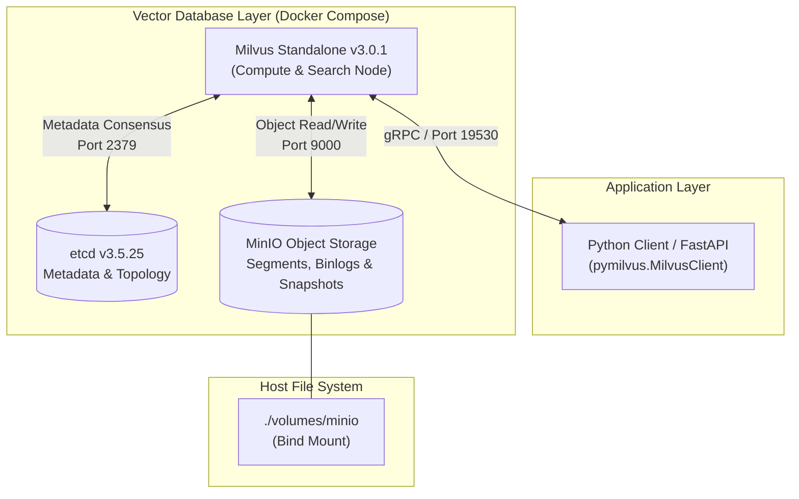

# Role of MinIO in the Song Search Project

This document explains why **MinIO** is included in the project, what role it plays, and how it interacts with the rest of the system.

---

## 1. Executive Summary

In this project, your Python application code **does not interact with MinIO directly**. 

Instead, **MinIO is an essential internal storage engine for [Milvus v3.0.1](https://milvus.io/)** (the vector database used to store and search lyrical embeddings). Milvus relies on MinIO as its persistent object storage layer for vector data, segment files, and write-ahead logs (WAL).

---

## 2. Why Milvus Requires MinIO

Milvus is built upon a **cloud-native, disaggregated architecture** that strictly separates **compute** (querying, index building, and similarity search) from **storage** (persisting vector records and metadata).

### Key Responsibilities of MinIO:

1. **Segment and Binlog Persistence:**
   When song vectors and metadata are inserted via `build_index.py` or `migrate_faiss_to_milvus.py`, Milvus writes mutations to binary logs (binlogs) and flushes them into immutable **segment files**. These segment files are stored as objects inside MinIO.
2. **Vector Index Persistence:**
   The search index (e.g., `FLAT` index representations) and collection snapshots are persisted to MinIO.
3. **Data Durability Across Container Lifecycles:**
   Milvus compute containers are designed to be stateless. When containers are stopped or restarted (`docker compose stop`, `docker compose down`), all vector data persists in MinIO. MinIO writes to the host directory `./volumes/minio` (configured in `deploy/milvus/docker-compose.yml`).
4. **Cloud Portability via Standard S3 API:**
   MinIO implements an AWS S3-compatible API. In local development, MinIO acts as local object storage without requiring cloud costs or external internet access. In a production deployment (e.g., AWS, GCP, Azure), Milvus can point directly to AWS S3, Google Cloud Storage, or Azure Blob Storage without changing database schemas or query logic.

---

## 3. Configuration & Ports

MinIO is configured in [`deploy/milvus/docker-compose.yml`](deploy/milvus/docker-compose.yml):

| Service | Container Name | Ports | Purpose |
| :--- | :--- | :--- | :--- |
| **MinIO API** | `milvus-minio` | `127.0.0.1:9000` | S3-compatible API endpoint used by Milvus |
| **MinIO Console**| `milvus-minio` | `127.0.0.1:9001` | Web UI for browsing buckets and data objects |
| **Milvus** | `milvus-standalone` | `127.0.0.1:19530` | gRPC endpoint used by `pymilvus` |

> [!NOTE]
> All ports are explicitly bound to `127.0.0.1` (localhost) for local development security.

### Default Local Credentials

- **Access Key:** `minioadmin`
- **Secret Key:** `minioadmin`
- **Console Web UI:** `http://127.0.0.1:9001`

You can open `http://127.0.0.1:9001` in your browser while Docker Compose is running to inspect the underlying storage buckets (e.g., `milvus-bucket`) created by Milvus.

---

## 4. Frequently Asked Questions

### Do I need to write Python code to talk to MinIO?
**No.** Your Python code in `src/` only imports and communicates with `pymilvus.MilvusClient`. Milvus manages all communication with MinIO automatically.

### Can I delete or remove MinIO from `docker-compose.yml`?
**No.** If MinIO is stopped or removed from the Compose file, Milvus Standalone will fail its healthcheck and refuse to start because it cannot establish its storage backend.

### Where is the actual data stored on disk?
By default, data persists on your host machine under:
`deploy/milvus/volumes/minio/`
